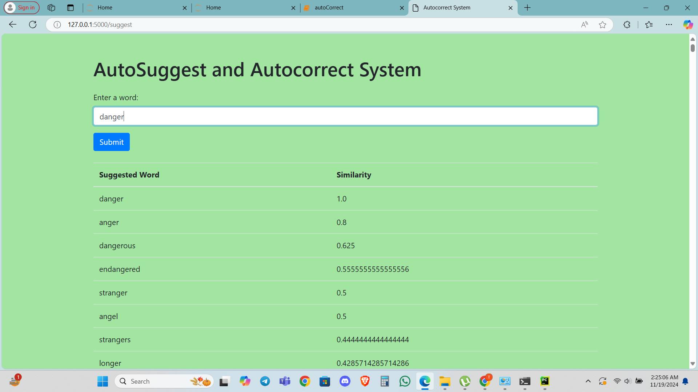
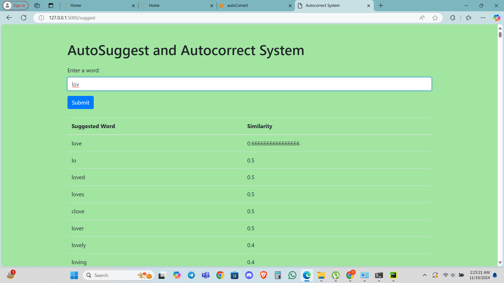
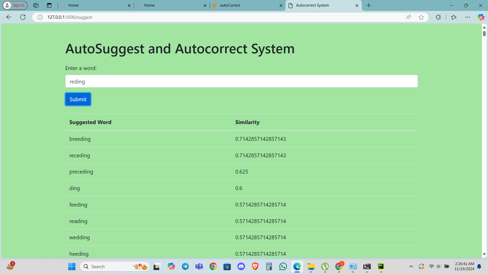

# 📝 Autocorrecting using NLP

Welcome to **Autocorrecting using NLP**, an intelligent system that suggests the most probable corrections for any word using natural language processing techniques and a custom-built vocabulary from a book.

---

## 💡 Project Overview

This project implements an **autocorrect system** inspired by classic NLP approaches. It uses a vocabulary extracted from a book to correct potentially misspelled words by ranking suggestions based on similarity and word probabilities.

---

## 📚 Vocabulary Source

- **Source**: Text from a book.
- **Processing**:
  - Extracted all **unique words**.
  - Counted the frequency of each word to build a robust vocabulary.

---

## ⚙️ Approach

### 🔢 Building the Probability Dictionary

- Created a dictionary: `word_freq_dict` to store each word and its frequency.
- Calculated probabilities for each word:

```python
prob[word] = word_freq_dict[word] / Total_word_freq

-Either written word existed exactly in prob,otherwise
-used cosine similarity to suggest top 7/8 similar words

```

## 🖼️ Demo Screenshot








